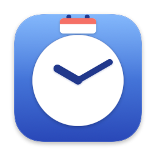
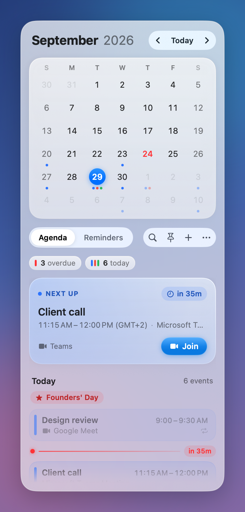

<div align="center">



# Kello

**A calendar for your menu bar.**

[](#requirements)
[](Package.swift)
[](https://www.gnu.org/licenses/gpl-3.0.html)

<picture>
  <source media="(prefers-color-scheme: dark)" srcset="docs/screenshots/popover-dark.png">
  
</picture>

</div>

## Features

- **Menu bar**: the date and time, with weekday, month name, year and a 12- or 24-hour clock each toggled on their own, or a custom date pattern.
- **Month grid** with optional week numbers and holidays highlighted.
- **Agenda**: a "Next up" card for what's next today, then the rest of the day or the upcoming days, with a one-click Join button on calls.
- **Events and reminders**: create, edit and delete, with a double click on any day.
- **Calendars**: choose which ones show in the grid and agenda.
- **Search** across events from the popover.
- **Quick entry**: type "Lunch with Sara friday 1pm" and Kello parses the date and time.
- **Time zones**: extra clocks in the popover, and a menu bar time zone different from your own.
- **Global shortcut** to show or hide Kello from any app.
- **Meeting notifications** before events start, with a Join action.
- **Launch at login**.
- **English and Italian**.
- **Automatic updates** via Sparkle.

## Requirements

- A Mac with macOS 26 or later.

## Install

Download the latest `Kello-<version>.dmg` from [Releases](https://github.com/gabry-ts/kello/releases), drag the app to Applications, and open it.

Kello checks for updates itself from then on; see **Settings > About** to change how often.

Launch Kello. The calendar appears in the menu bar; grant calendar and reminders access when asked.

## Build from source

Requires Xcode (or the Command Line Tools) with Swift 6.2.

```sh
./scripts/build.sh      # build/Kello.app
open build/Kello.app
./scripts/make-dmg.sh   # build/Kello-<version>.dmg
swift test              # core tests
```

`scripts/build.sh` produces a universal (Apple Silicon and Intel) build signed with a Developer ID identity by default; set `KELLO_SIGN_IDENTITY=-` for an ad-hoc local signature, or to your own identity. `Kello --render-snapshots <dir>` renders every screen with sample data, and `Kello --render-icon <dir>` the app icon.

## Uninstall

Quit Kello and remove it from `/Applications`. Delete `~/Library/Application Support/Kello` to also clear its settings.

## Privacy

- All your data stays on your Mac: Kello reads and writes calendars and reminders through EventKit and never sends them anywhere.
- No analytics, no account, no server. The only network access is Sparkle's update check.

## License

Copyright (C) 2026 Gabriele Partiti

Kello is free software, released under the [GNU General Public License v3.0](https://www.gnu.org/licenses/gpl-3.0.html).

## Buy me a coffee

Kello is free. If it makes your days a little easier, you can [buy me a coffee](https://buymeacoffee.com/gabrielepartiti).
